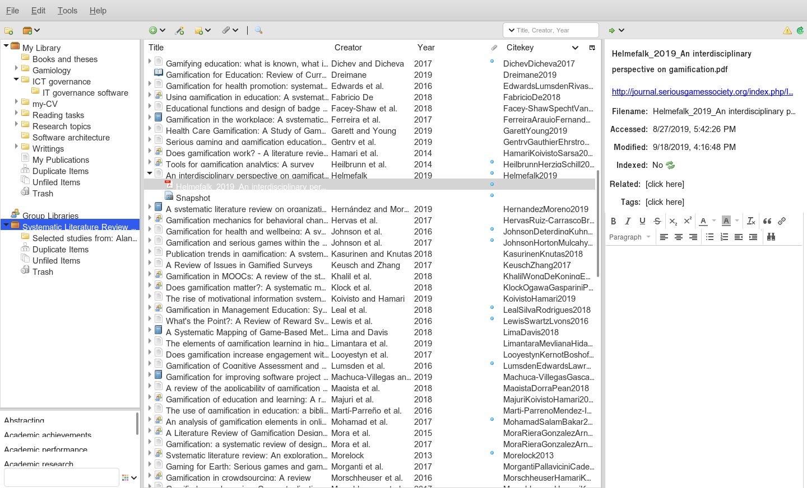
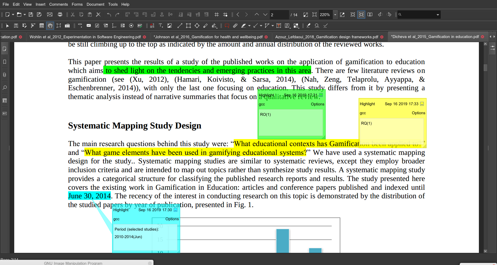
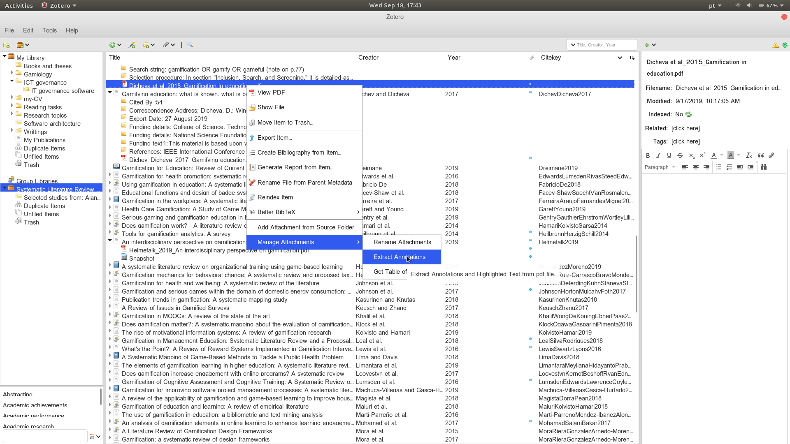
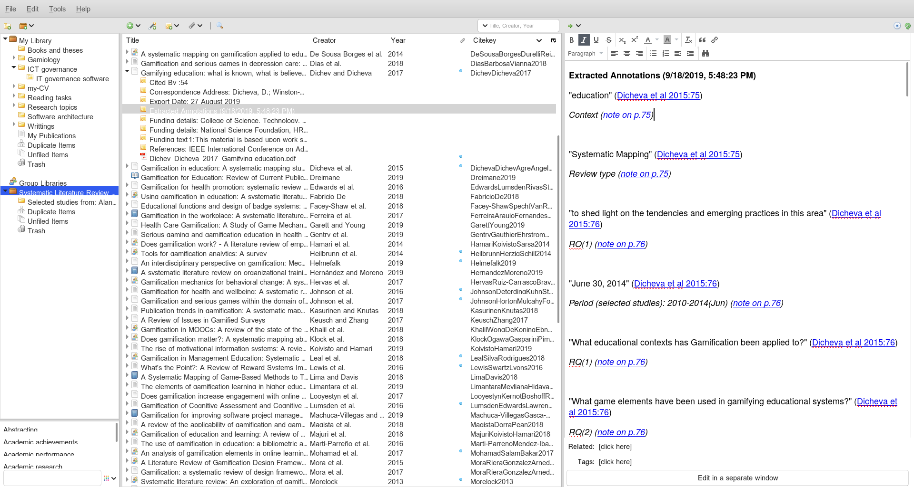
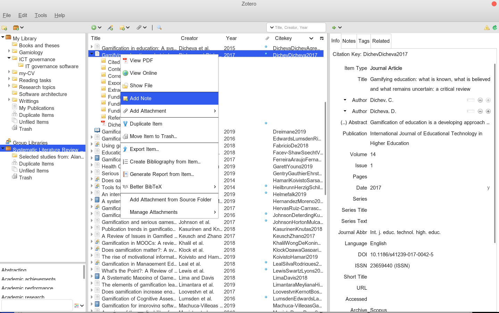
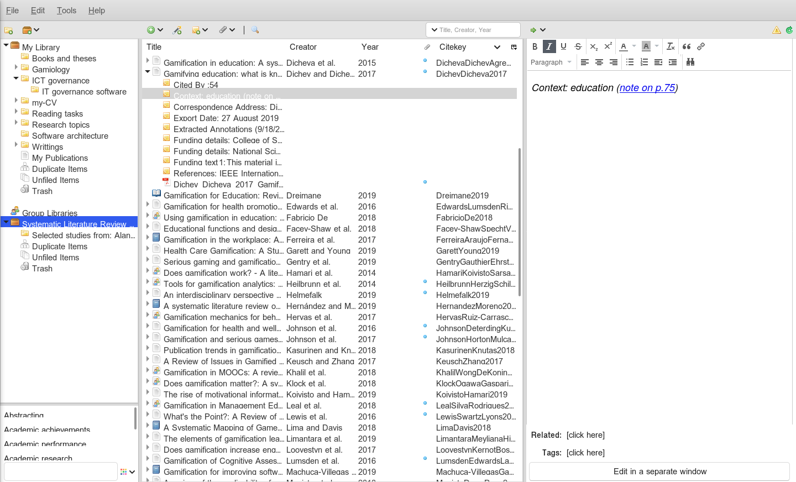
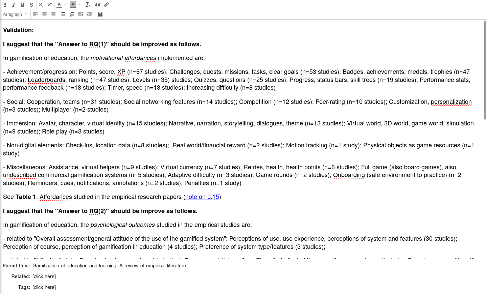
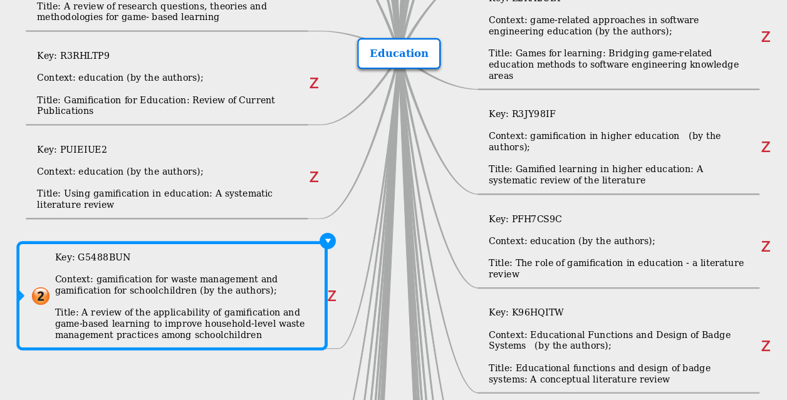
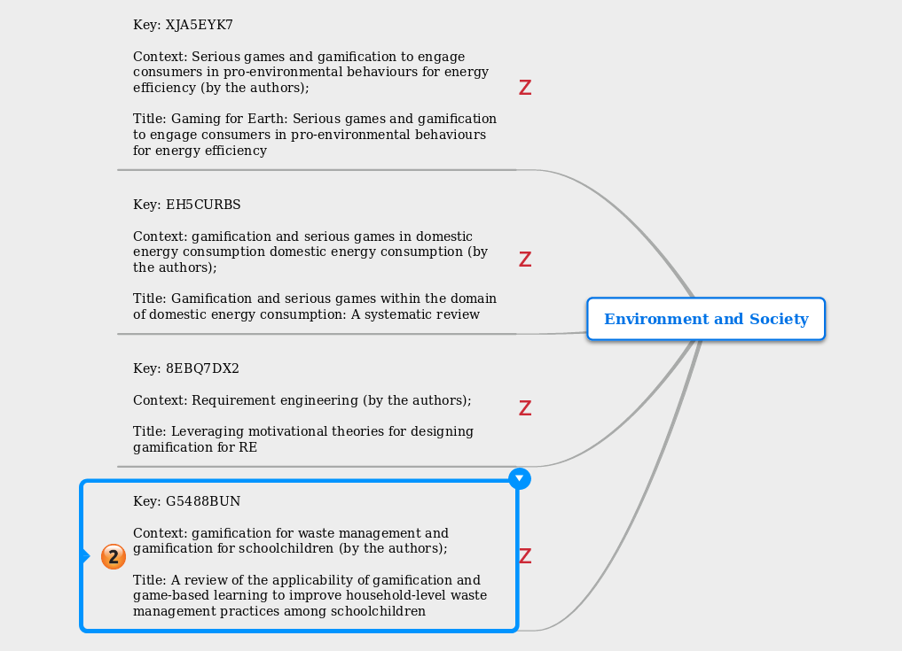

# Summary of the tertiary review on gamification

* [Data extraction phase](#data-extraction-phase)
* [Data analysis phase](#data-analysis-phase)

# Data extraction phase

* [Tools for the data extraction process](#tools-for-the-data-extraction-process)
* [Data extraction process using zotero](#data-extraction-process-using-zotero)
* [Validation of extracted data using zotero](#validation-of-extracted-data-using-zotero)

To install a plugin in Zotero, download its .xpi file to your computer. Then, in Zotero, click “Tools → Add-Ons”, then drag the .xpi for the plugin onto the Add-Ons window that opens

## Tools for the data extraction process

1. Install zotero desktop ([https://www.zotero.org/download/](https://www.zotero.org/download/))
2. Install better-bibtex plugin into zotero ([http://retorque.re/zotero-better-bibtex/](http://retorque.re/zotero-better-bibtex/))
3. Install zotfile plugin into zotero ([http://zotfile.com/](http://zotfile.com/))

## Data extraction process using zotero

To participate in the data extraction process register as member of the group "systematic_literature_review_of_gamification" in the website of zotero through the URL: [https://www.zotero.org/groups/2366342/systematic_literature_review_of_gamification](https://www.zotero.org/groups/2366342/systematic_literature_review_of_gamification)

1. Open the PDF file attached to the item of zotero in the group library using your favorite PDF editor (e.g. Acrobat PDF reader, PDF Foxit, Master PDF)

2. Annotate the data on the PDF file using the highlight and sticky note tools of the PDF editor as shown on the Figure below - the labels used to annotate the data are detailed on the tables of section "**Data to be extracted (data extraction form)**".

If some data won't be found in the paper, don't worry. It means that these data were not published by the authors in the review. 

3. Use the extraction tool of zotfile plugin to automatically extract the annotations as shown on Figures below.

4. Conver each annotation into a note. Encode each note using the text "[Label]: ..." at the begin of the notes as shown in the Figures below for the data: "Context".

#### Data to be extracted (data extraction form)

In general from the Abstract and Introduction section, the following data may be extracted:

| Label | Description |
|--------|----------|
| Review type | Type of literature review. Some possible values are: systematic liverature review, systematic literature mapping, meta-analysis, bibliometric analysis. (as was explicitly indicated by the author - plz, dont use your own criteria) |
| RO(_n_) | Review objective. For the 1st review objective use the label: RO(1). For the 2nd review use the label: RO(2), ... In general, you can found the review objectives described in the abstract or introduction section with phrases such as "this review aims to ....". |
| Context | Context in which the gamification is framed for the review. For example, "software enginnering education" when the literature review is something like "gamification on software enginnering education." |
| Number of selected studies | The number of selected studies after the selection process. The number of studies used in the literature review to answer the research questions. |
| Period (selected studies) | The range of years for the selected studies |

In general from the Method section, the following data may be extracted:

| Label | Description |
|--------|----------|
| Databases | Databases in which the search string is applied to find the primary studies |
| Search string | Search string used to find the primary studies. Format the search string using AND and OR operators |
| Search strategy | Search strategy used by the authors to find the studies in the databases (As was explicitly indicated by the authors in the paper) |
| Exclusion criteria | List of exclusion criteria as was explicitly indicated by the paper's authors |
| Inclusion criteria | List of inclusion criteria as was explicitly indicated by the paper's authors |
| Selection procedure | Selection procedure of studies as was explicitly indicated by the paper's authors |
| Quality assessment criteria | Criteria for quality assessment as was explicitly indicated by the authors in the article |
| Quality assessment procedure | Quality assessment procedure as was explicitly indicated by the authors in the article |
| Preventive steps to minimize bias and errors in the quality assessment | Steps taken to avoid bias in the quality assessemnt as was explicitly indicate by the author in the paper (frequently indicated in the "Limitation" or "Validity Evaluation") |
| Data extraction form | Form used during the data extraction process as was explicitly indicated by the authors in the review (mention only the fields and reference to this form) |
| Data extraction process | Data extraction procedure as was explicitly indicated in the review |
| Preventive steps to minimize bias and errors in the data extraction process | Steps taken to avoid bias in the Data extraction process as was explicitly indicate by the author in the paper (frequently indicated in the "Limitation" or "Validity Evaluation") |

In general from the Results and Discussion sections, the following data may be extracted:
 
| Label | Description |
|--------|----------|
| RQ(_n_) | Research question. For the 1st research question, you should use "RQ(1)." For the 2nd research question, you should use RQ(2) ... . If research questions are not explicitly indicated by the authors but they are inferred from the results indicated in the section "results" or "discussion", you should use (inferred) at the end of the research question in the note. |
| Answer to RQ(_n_) | Answer to the research question. To indicate the answer for the 1st research question, you should use "Answer to RQ(1)." To indicate the answer for the 2nd research question, you should use "Answer to RQ(2)" ...  |
| Method of data synthesis to answer RQ(_n_) | Method used to synthesis data and answer the research question. Some examples of data sysnthesis are: narrative texts, tabular, bar charts, bubble chart,... |
| Method of presenting details (about selected studies) to answer RQ(_n_) | Method to present the details bout each selected study in reference to the research question _n_. Some examples of method frequently used to present details are: use of tabular data, narrative texts. |

From the Discussion and Conclusion sections, the following data may be extracted:  

| Label | Description |
|--------|----------|
| Flaw on the gamification research | Flaw  and gaps about gamification research indicated by the authors reviews |
| Practitioner guideline | Some literature review at the discussion and conclusions indicated guidelines to practitioner about gamification based on the evidences found in the selected studies. Such as, "based on ...., we suggest that educators/designers/developers should be .... " | 
| Research agenda | Some literature reviews indicate a research questions or issues that the authors suggest to explore in a near future |

## Validation of extracted data using zotero

To validate the extracted data, You only as _second reviewer_ need to open the PDF-file of the article, and to validate the annotations making by the _main reviewer_ (_reviewer assigned to the data extraction_). If you notice troubles or you have suggestions, you should create a new note that begins with the text "Validation:" as shown in the figures below.

After the validation, the _main reviewer_ can solve the troubles and/or accept the suggestion pointed by the _second reviewer_.
If there is a disagreement between the _main reviewer_ and _second reviewer_, a _third reviewer_ will be assigned to solve the disagreement at the end of the data extraction process.

# Data analysis phase

The data analysis is carried out through quantitative and qualitative methods. These methods are:

* [Method: Classification schemes (qualitative method)](#method-classification-schemes-qualitative-method)

## Method: Classification schemes (qualitative method)

A classification scheme is used to group the extracted data based on the common characteristics of them. Therefore, the tool mindomo is used for this purpose.

* Tool: Mindomo ([https://www.mindomo.com](https://www.mindomo.com))
 
Some information may fall in more than one category. Therefore, when the data extracted fall in more than one category, an icon is used to indicate the number of categories in which this data fall. As example, in the figure below, we shows that the information "Gamification for waste management and gamification for schoolchildren" extracted from the litetarture review "A review of the applicability of gamification and game-based learning to improve household-level waste management practices among schoolchildrens" fall in the two categories: (1) "education", and (2) "environment and society".

We built the following classification schemes: 

1. Classification of literature reviews by type
  * Purpose: Identify the types of review on gamification.
  * URL: [https://www.mindomo.com/mindmap/classification-by-review-types-c5761495660e44f78c98868ea16e087f](https://www.mindomo.com/mindmap/classification-by-review-types-c5761495660e44f78c98868ea16e087f)
  * Responsable researcher to classify: geiser@usp.br 
  * Responsable researcher to validate: diego.matos@famed.ufal.br
  * The classification of reviews by types follows the characteristics indicated in the table.

  | Review type | Description |
  |-------------|-------------|
  | Structured Narrative Review | Close similar to a traditional review because may have bies. Its extraction processes may be unclear, may not include qualitative analysis or not use classification as methods of data synthesis (such as voting, counting or other) |
  | Descriptive or Mapping Review | Review that includes clear selection and data extraction process. A qualitative assessment is not carried out, and the data analysis is based on the interpretation of each selected study as a unit in the whole  published literature | 
  | Scoping Review | Review that includes clear selection and data extraction process. Close similar to structure narrative review or descriptive/mapping review, but it includes gray literature. |
  | Critical Review | A review that includes evaluation and an interpretive analysis of existing literature on a particular topic of interest to reveal strengths, weaknesses, contradictions, controversies, inconsistencies, and/or other important issues with respect to theories, hypotheses, research methods and/or empirical results. |
  | Realistic Review | Review based on a theoretical model/framework in which the data is structured according to this framework/model to find out whether, where and how it is applicable. |
  | Systematic Review | Review with qualitative assessment to synthetize and analyze the extracted data from primary studies. |
  | Meta-analysis | In adittion to a qualitative assessment of primary studies, a meta-analysis includes statistical analysis on effect sizes to combine the results of independent studies, and to find significant differences. |
  
2. Classification of literature reviews by contexts
  * Purpose: Identify the contexts in which gamification was framed for the literature review.
  * URL: [https://www.mindomo.com/mindmap/classification-of-reviews-by-context-fe0a4a1a13a6493eb46d1d4b407794f2](https://www.mindomo.com/mindmap/classification-of-reviews-by-context-fe0a4a1a13a6493eb46d1d4b407794f2)
  * Responsable researcher to classify: geiser@usp.br
  * Responsable researcher to validate: diego.matos@famed.ufal.br
  * The contexts in which the reviews are classified follows the next scheme:
    - Health (E.g. gamification in health)
    - Education (E.g. gamification in higher education)
    - Environment and Society (E.g. gamification to promote waste recycling)
    - Business, Marketing, Enterprise and Services
      * Software Engineering (E.g. gamification in software engineering)
      * Crowsourcing (E.g. gamification in crowsourcing)
      * Information Systems (E.g. gamification in information systems)
    - Without context (E.g. gamification per-se, gamification frameworks)

4. Classification of research questions used on the gamification research:
  * Purpose: Identify the research questions explored by the literature reviews on gamification.
  * URL: [https://www.mindomo.com/mindmap/a64d340f6f504397bd68afb61b0d3297](https://www.mindomo.com/mindmap/a64d340f6f504397bd68afb61b0d3297)
  * Responsable researcher to classify: geiser@usp.br
  * Responsable researcher to validate: leonardo.marques@cedu.ufal.br
  * The major groups for the classification of RQs are:
    - RQs about the game-related approaches
    - RQs about the gamification-based design
    - RQs about the adaptive gamification
    - RQs about the gamification analytics
    - RQs about the gamification models/frameworks
    - RQs about the publication information on gamification
    - RQs not related to gamification or game-related approaches (RQs related to the non-game contexts)

3. Classification of review objectives on gamification research:
  * Purpose: Identify the review objectives explored by the literature reviews on gamification.
  * URL: [https://www.mindomo.com/mindmap/fcb801a4b2d64d4ab0014f667783fa58](https://www.mindomo.com/mindmap/fcb801a4b2d64d4ab0014f667783fa58)
  * Responsable researcher to classify: bianyang@bnu.edu.cn
  * Responsable researcher to validate: geiser@usp.br

